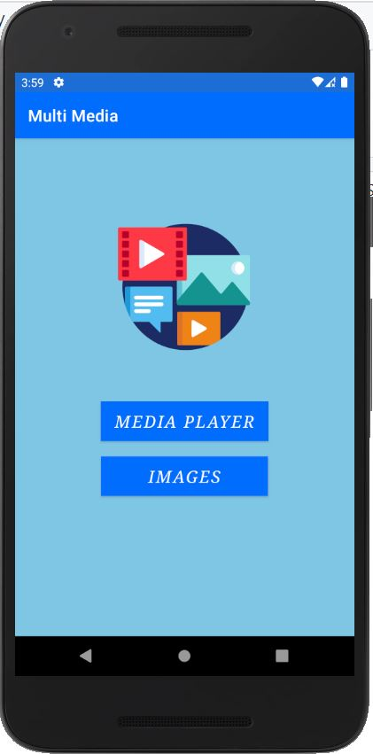
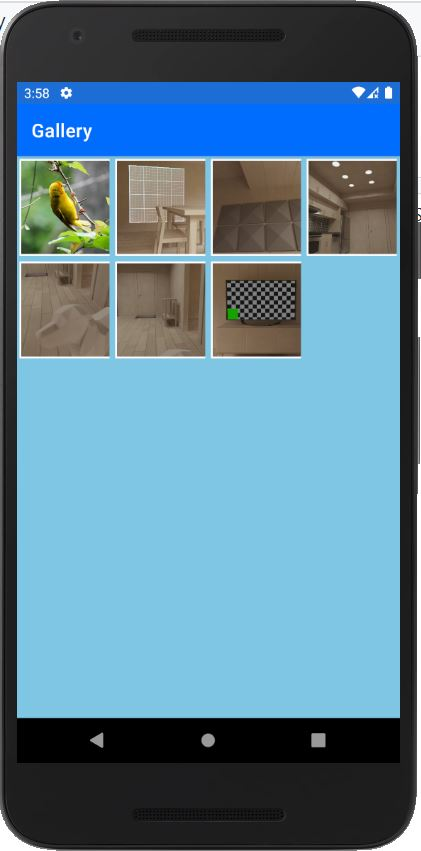
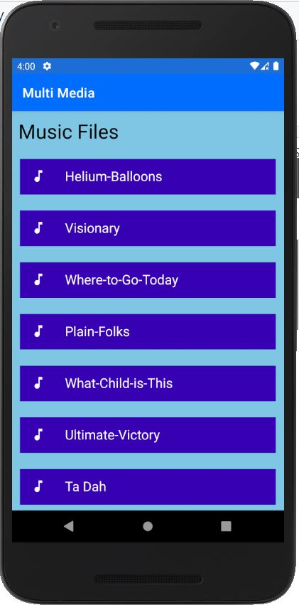
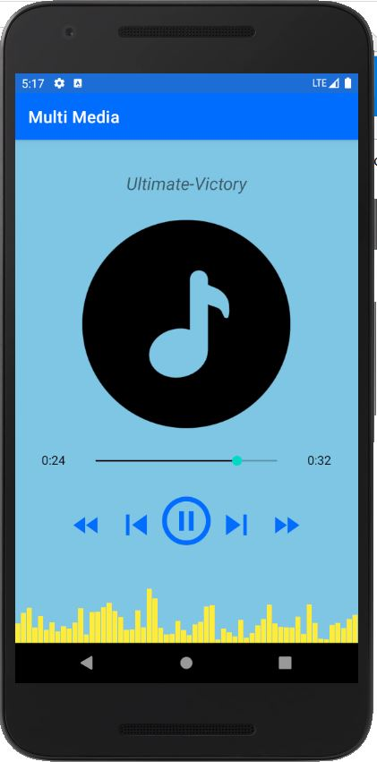
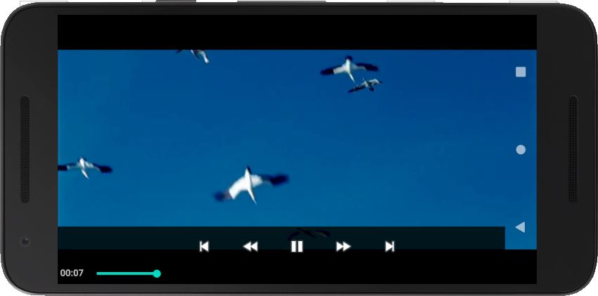

# Media-Player
An entertainment app that integrates music, video &amp; pictures in one platform.

- With this app users can play all songs & videos present in the mobile device.
- The app provides a camera-feature to take photos.
- The app also provides a gallery to fetch all images present in the mobile device.

#### The design of this multimedia app:

#### Some glimpses of the app:

